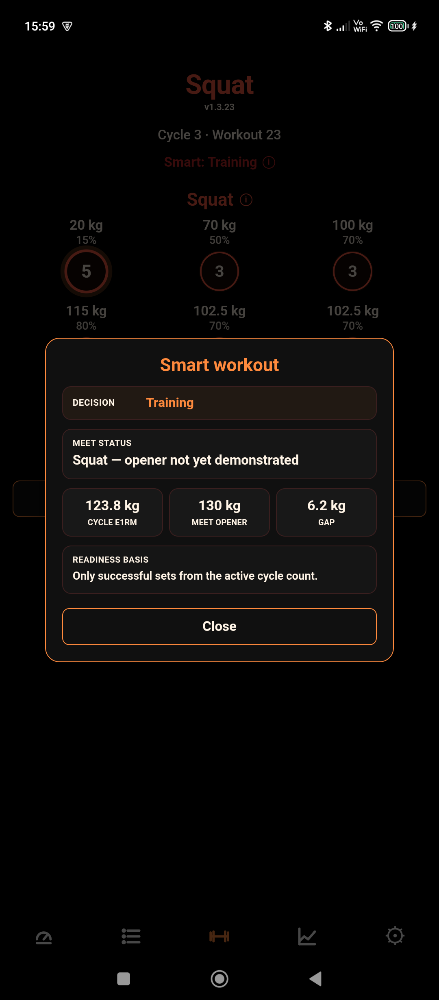

# Kelani SBD Tracker

**Kelani SBD Tracker** is a calm, offline-first powerlifting app for structured Squat, Bench Press and Deadlift training.

It helps you plan, track and complete SBD workouts without accounts, ads, subscriptions, analytics or cloud lock-in. Your training data stays on your device unless you choose to export it.

Latest release: https://github.com/mburgosfr-star/kelani-sbd-tracker/releases/latest
Issues and support: https://github.com/mburgosfr-star/kelani-sbd-tracker/issues

## Why Kelani?

Most training apps are either too generic, too social, too expensive, or too dependent on cloud accounts.

Kelani is intentionally smaller and calmer. It focuses on the training flow itself: clear SBD workouts, practical progression, useful feedback, and local control of your data.

- **Focused on SBD** — built around Squat, Bench Press and Deadlift
- **Offline-first** — your training data stays on your device
- **No account required**
- **No ads**
- **No analytics or tracking**
- **No subscription or locked training features**
- **Open source** — the code is public
- **Built for practical long-term progress, not social media engagement**

## Smart Training

Smart Training creates the next workout from the lifter’s actual training history instead of relying on a fixed template.

It can:

- select primary and secondary lifts from recent training frequency and meet readiness;
- prescribe warm-ups, top work, back-off work and accessories;
- adapt to successful work, perceived effort, fatigue, failed sets and skipped sets;
- track whether planned meet openers have been demonstrated;
- avoid unnecessary repetition of recent primary-lift prescriptions;
- preserve complete set grids on mixed-lift and single-lift training days;
- refresh pending workouts when the prescription model changes.

All Smart calculations run locally on the device.

## Features

- Structured Squat, Bench Press and Deadlift training cycles
- Smart and manually planned training
- Workout tracking with warm-ups, top work, back-off work and optional accessories
- Automatic progression based on completed training
- Lift-specific readiness and estimated 1RM tracking
- Rest timer with audio signals
- 1RM, estimated 1RM and strength statistics
- Bodyweight and body composition logging
- Perceived effort tracking for sets and completed workouts
- Meet Planner for attempt selection before competition day
- Meet prep checklist for practical competition-day preparation
- Exercise alternatives for lifters who need temporary lower-stress options
- Local data export and import
- Multilingual interface: English, Catalan and Dutch

## Download

### IzzyOnDroid / Neo Store

https://apt.izzysoft.de/packages/com.kel.powerlifting

### Latest APK on GitHub

https://github.com/mburgosfr-star/kelani-sbd-tracker/releases/latest

## Screenshots

| Dashboard | Smart Training |
|---|---|
|  |  |

| Workout | Statistics |
|---|---|
|  |  |

## Feedback and support

Kelani is actively developed and real user feedback matters.

If something is confusing, broken, missing, or useful to you, please open an issue:

https://github.com/mburgosfr-star/kelani-sbd-tracker/issues

Good feedback examples:

- “This workout screen is hard to understand because…”
- “This exercise alternative would help me because…”
- “The Dutch/Catalan/English text sounds wrong here…”
- “I expected the app to do X, but it did Y.”

## Support Kelani

Kelani is free, offline-first and open source. There are no ads, subscriptions or tracking.

If the app helps your training, you can support the project here:

https://github.com/sponsors/mburgosfr-star

Support helps keep Kelani maintained, tested on real devices, improved over time, and independent.

## Build from source

A recent Node.js version and JDK 21 are required.

    npm ci
    npm run build
    npx cap sync android
    cd android
    ./gradlew assembleRelease

Official APKs are built, tested and published through the guarded release process.

## Project links

- Latest release: https://github.com/mburgosfr-star/kelani-sbd-tracker/releases/latest
- All releases: https://github.com/mburgosfr-star/kelani-sbd-tracker/releases
- Issues and feature requests: https://github.com/mburgosfr-star/kelani-sbd-tracker/issues
- IzzyOnDroid: https://apt.izzysoft.de/packages/com.kel.powerlifting
- GitHub Sponsors: https://github.com/sponsors/mburgosfr-star

Maintained by [Kel](https://github.com/mburgosfr-star).
