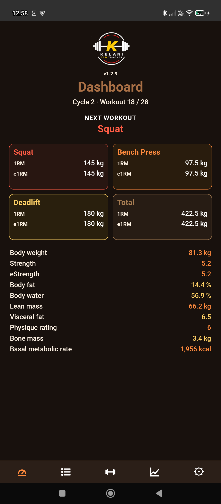
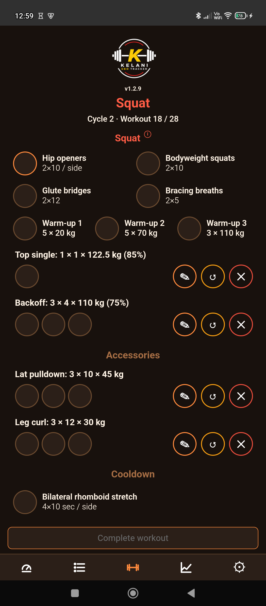
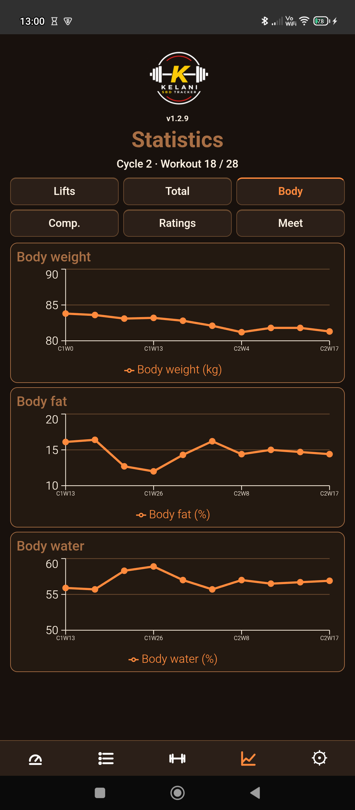

# Kelani SBD Tracker

Kelani SBD Tracker is a simple offline-first powerlifting app to track Squat, Bench and Deadlift training cycles.

## Features

- Structured SBD training programs
- Automatic progression based on performance
- Rest timer with audio signals
- Bodyweight tracking
- Strength ratio tracking
- Detailed statistics and graphs
- Offline-first: no internet required
- No ads
- No tracking
- Multilingual interface

## Download

IzzyOnDroid / Neo Store:

https://apt.izzysoft.de/packages/com.kel.powerlifting

Latest APK on GitHub:

https://github.com/mburgosfr-star/kelani-sbd-tracker/releases/latest

## Screenshots

## Build from source

Requires JDK 21.

npm install  
npm run build  
npx cap sync android  
cd android  
./gradlew assembleRelease  

For a clean release-style build:

npm install  
npm run build  
npx cap sync android  
cd android  
./gradlew clean assembleRelease --no-build-cache --no-configuration-cache --no-daemon  

## Notes

Kelani SBD Tracker is built for simplicity and consistency in training.
