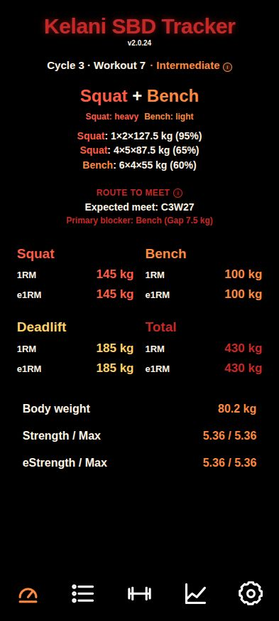
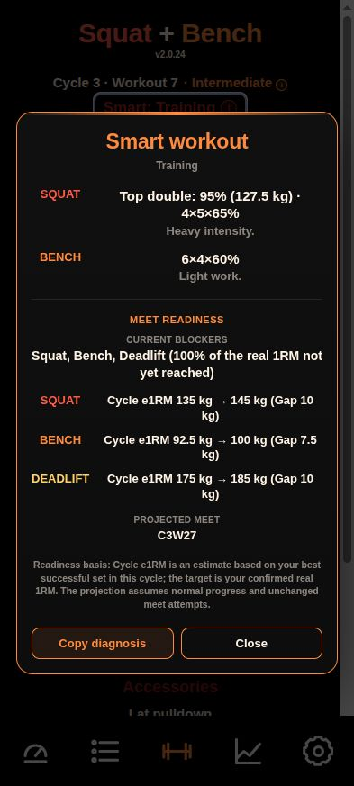
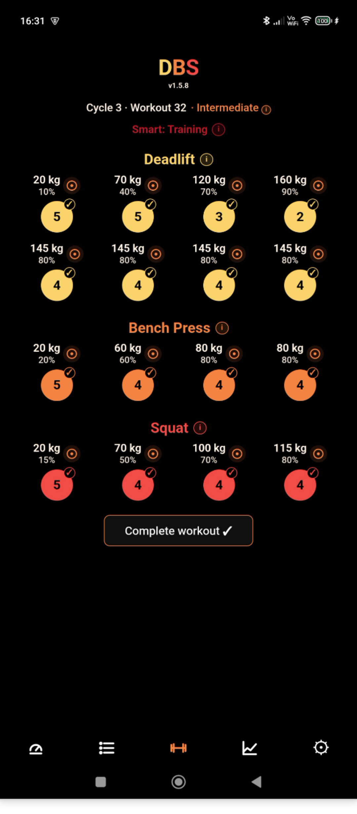
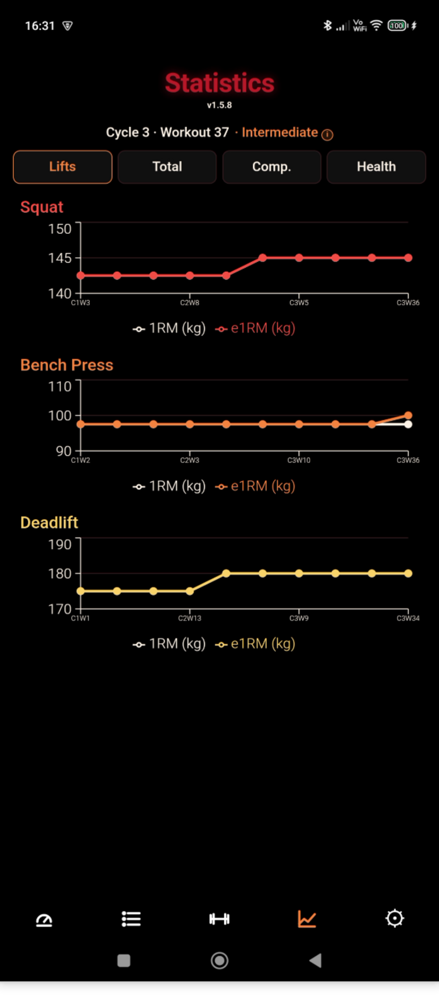

# Kelani SBD Tracker

[](https://github.com/mburgosfr-star/kelani-sbd-tracker/releases/latest)

**Adaptive powerlifting training that stays on your device.**

Kelani is an offline-first Android app for Squat, Bench and Deadlift. Its main training model, Smart Training, does not give you a long static calendar. It plans one next workout at a time from the training you actually completed and how that work affected your readiness.

After every completed workout, Kelani interprets your recent training load, lift frequency, successful and failed work, skipped sets, workout difficulty, current strength and progress toward your planned meet attempts. It uses those signals to choose what to train next and to prescribe the sets, reps and barbell-loadable weights.

## Smart Training

Smart Training continuously rebuilds the plan around your real training history. It can:

- choose the next lift or combination of lifts based on priority, recent exposure and your training level;
- balance heavy, medium and light work instead of repeating the same session structure;
- progress successful work and respond to difficult, failed or skipped work;
- schedule recovery or deload work when fatigue, training streaks or completed workload call for it;
- generate preparation, warm-ups, top sets, back-off work and optional accessories for the selected session;
- work toward your Meet Planner attempts, then taper and schedule meet day when the required strength has been demonstrated;
- show the reasoning behind the next-workout decision and each lift's planned intensity.

Kelani generates only the next relevant workout, so new performance and feedback can influence the plan immediately instead of waiting for a fixed cycle to end.

## During and around training

- Follow a set-by-set workout view with preparation, warm-ups, main work, accessories and cooldown options.
- Record completed, failed or skipped sets and rate both sets and the full workout.
- Use the built-in rest timer and plate calculator while training.
- Track real 1RM, estimated 1RM, SBD totals, Strength, eStrength and body statistics.
- Plan competition attempts, follow meet readiness and use a meet-day checklist.
- Choose kilograms or pounds and use alternative lift profiles when standard SBD is not suitable.
- Export, import and share local JSON backups; Android also keeps an automatic emergency backup after completed workouts.
- Use the app in English, Catalan or Dutch.

## Smart and Classic

New installations start with Smart Training. Classic Training contains the earlier fixed programs and remains available to existing Classic users in maintenance mode. They can continue their current program or switch permanently to Smart Training, which uses their existing training history.

Kelani has no accounts, ads, subscriptions, analytics or cloud synchronization. All training calculations run locally, and your data stays on your device unless you explicitly export or share it.

## Download

Both channels distribute the current Kelani 2.x Android app (`com.kelani.sbdtracker`):

- [Kelani 2.x APK from GitHub Releases](https://github.com/mburgosfr-star/kelani-sbd-tracker/releases/latest)
- [Kelani 2.x on IzzyOnDroid](https://apt.izzysoft.de/packages/com.kelani.sbdtracker)

## Android app identities and migration

Kelani 2.x is the current continuation of Kelani, but it uses a deliberately new Android app and signing identity. `com.kelani.sbdtracker` is the stable package identity for the 2.x line. Android therefore treats it as a different app from legacy Kelani 1.x; installing 2.x does not update or overwrite `com.kel.powerlifting`.

| Kelani line | Status | Android AppID | Update path |
|---|---|---|---|
| 2.x | Current | `com.kelani.sbdtracker` | Updates normally to later 2.x releases from GitHub or IzzyOnDroid |
| 1.x | Legacy | `com.kel.powerlifting` | Requires a one-time JSON backup migration to 2.x |

The two AppIDs have separate Android storage. Training data is not transferred automatically. Existing 1.x users should:

1. Open the legacy app and export a JSON backup from Settings → Data.
2. Keep the legacy app installed and install Kelani 2.x from either current download channel above.
3. Import the backup from the first setup screen. If setup was already completed, use Settings → Data.
4. Confirm that training history, PRs, body data and in-progress work are present before removing the legacy app.

Both apps can remain installed side by side during the migration. Never remove the legacy app before creating and verifying a backup. Users already running `com.kelani.sbdtracker` are already on the 2.x identity and do not need to migrate again.

## Screenshots

| Dashboard | Smart Training |
|---|---|
|  |  |

| Workout | Statistics |
|---|---|
|  |  |

## Development

Use Node.js 22 for the web project. Java 21 is additionally required for Android builds.

```bash
npm ci
CI=true npm test -- --runInBand
npm run build
```

Public Android releases are produced through guarded repository automation.

## Feedback and support

Report bugs or suggest improvements through [GitHub Issues](https://github.com/mburgosfr-star/kelani-sbd-tracker/issues). You can support continued development through [GitHub Sponsors](https://github.com/sponsors/mburgosfr-star).

## License

Kelani is released under the [MIT License](LICENSE) and maintained by [Kel](https://github.com/mburgosfr-star).
